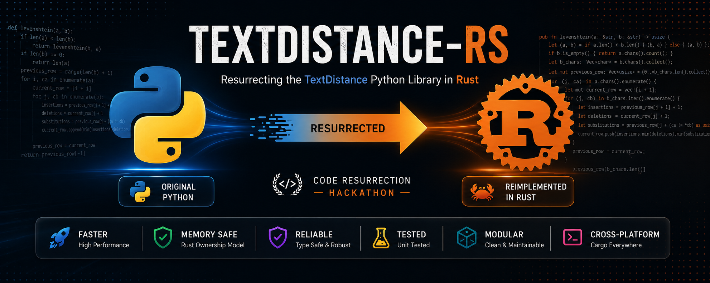

<p align="center">
  
</p>

<h1 align="center">
🦀 TextDistance-RS
</h1>

<h3 align="center">
Resurrecting the TextDistance Python Library in Rust
</h3>

<p align="center">


</p>

<p align="center">

🚀 Faster • 🔒 Memory Safe • ⚡ Zero-Cost Abstractions • 🧪 Tested • 📦 Modular

</p>

---

# 🌟 About the Project

**TextDistance-RS** is a Rust reimplementation of the popular **TextDistance** Python library, developed as part of the **Code Resurrection Hackathon**.

The project revives an established open-source repository by faithfully recreating its functionality in **Rust**, leveraging the language's performance, memory safety, and modern systems programming capabilities.

Instead of simply translating syntax, the project focuses on preserving algorithmic correctness while adopting idiomatic Rust design principles.

---

# 🎯 Project Objective

Our primary objective was to **resurrect** an existing open-source Python project into Rust while maintaining functional parity and improving maintainability.

### We aimed to

✅ Preserve the original algorithm logic

✅ Maintain identical outputs wherever applicable

✅ Utilize Rust's ownership model for memory safety

✅ Build a clean, modular architecture

✅ Improve execution efficiency

✅ Create a scalable foundation for future enhancements

---

# ✨ Features

🦀 Pure Rust Implementation

⚡ High Performance Execution

🔒 Memory Safe Architecture

📦 Modular Code Organization

🧩 Easy to Extend

🧪 Unit Tested

📚 Clean Documentation

♻️ Open Source

💻 Cross Platform

🚀 Cargo Based Build System

---

# 🛠️ Project Structure

```
textdistance-rs
│
├── src
│   ├── edit.rs
│   ├── lib.rs
│   ├── phonetic.rs
│   ├── sequence.rs
│   ├── simple.rs
│   ├── token.rs
│   ├── traits.rs
│   └── utils.rs
│
├── Cargo.toml
├── Cargo.lock
└── README.md
```

### 📂 Module Overview

| Module | Description |
|---------|-------------|
| 📝 edit.rs | Edit distance algorithms |
| 🔤 phonetic.rs | Phonetic similarity algorithms |
| 🔠 sequence.rs | Sequence comparison algorithms |
| 🧮 simple.rs | Basic similarity metrics |
| 🪙 token.rs | Token-based algorithms |
| 📚 traits.rs | Shared traits and abstractions |
| 🛠 utils.rs | Helper utilities |
| 📦 lib.rs | Library entry point |

---

# ⚙️ Getting Started

## Clone Repository

```bash
git clone https://github.com/darkweb-alt/textdistance-rs.git

cd textdistance-rs
```

---

## Build Project

```bash
cargo build
```

---

## Run

```bash
cargo run
```

---

## Run Tests

```bash
cargo test
```

---

# 🧪 Testing

Every implemented algorithm is validated using Rust's built-in testing framework.

```bash
cargo test
```

Example

```
running 24 tests

test result: ok.
```

---

# 🏗️ Development Workflow

```text
📂 Analyze Original Python Repository
                 │
                 ▼
📖 Study Algorithm Logic
                 │
                 ▼
🦀 Reimplement in Rust
                 │
                 ▼
🧪 Validate Outputs
                 │
                 ▼
⚡ Optimize Structure
                 │
                 ▼
📚 Document Project
```

---

# 🚀 Why Rust?

| 🐍 Python | 🦀 Rust |
|------------|---------|
| Dynamic Typing | Static Typing |
| Interpreter Required | Native Binary |
| Garbage Collection | Ownership Model |
| Runtime Memory Checks | Compile-Time Safety |
| Moderate Performance | High Performance |
| Runtime Errors | Safer Code |

---

# 📊 Highlights

🏆 Developed for the **Code Resurrection Hackathon**

📦 Modular Architecture

🦀 Idiomatic Rust Codebase

📚 Readable Source Code

🧪 Comprehensive Testing

🚀 High Performance Execution

🔒 Memory Safety

♻️ Open Source

---

# 🔮 Future Roadmap

- 🚀 Complete remaining algorithms

- 📊 Performance Benchmark Suite

- 📦 Publish on crates.io

- 🌍 Unicode Optimizations

- 🔄 Continuous Integration (CI)

- 📚 API Documentation

- ⚡ SIMD Optimizations

- 🤝 Community Contributions

---

# 🤝 Contributing

We welcome contributions from the community!

### Steps

🍴 Fork the repository

🌿 Create a feature branch

```bash
git checkout -b feature-name
```

💾 Commit your changes

```bash
git commit -m "Added new feature"
```

📤 Push to GitHub

```bash
git push origin feature-name
```

🎉 Open a Pull Request

---

# 👨‍💻 Team

<p align="center">

<a href="https://github.com/darkweb-alt">

</a>

<a href="https://github.com/Venkatachalam17">

</a>

<a href="https://github.com/Mrittika278">

</a>

<a href="https://github.com/praveen-0907">

</a>

</p>

<p align="center">

<b>Member 1</b> &nbsp;&nbsp;&nbsp;
<b>Member 2</b> &nbsp;&nbsp;&nbsp;
<b>Member 3</b> &nbsp;&nbsp;&nbsp;
<b>Member 4</b>

</p>

---

# 🙏 Acknowledgements

Special thanks to the creators and maintainers of the original **TextDistance** Python library for making their work available to the open-source community.

Their project served as the inspiration and technical foundation for this Rust implementation.

---

# 📜 License

This project is released under the **MIT License**.

See the **LICENSE** file for complete details.

---

<p align="center">

### ⭐ If you found this project useful, consider giving it a Star!

Made with ❤️ in Rust for the **Code Resurrection Hackathon**

</p>
